# SISOP-1-2026-IT-041

| Nama                   | NRP        |
| ---------------------- | ---------- |
| Muhamad Sabilil Haq    | 5027251041 |

## Soal 1

Pertama, download dulu file ``passenger.csv``, kemudian lihat dulu sebagian isi dari filenya menggunakan command ``cat passenger.csv | head``

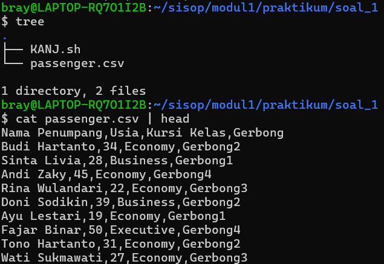

### a. Menghitung total penumpang
Untuk menghitung total penumpang, bisa dengan menjumlahkan keseluruhan barisnya menggunakan command:

```
awk 'NR>1 {count++} END{print "Jumlah seluruh penumpang KANJ adalah " count " orang"}' passenger.csv
```

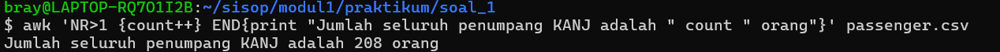

yang mana ``NR>1`` untuk memfilter header agar tidak terhitung sebagai penumpang.

### b. Menghitung total gerbong
Untuk menghitung total gerbong pada kereta, bisa dengan command:

```
awk '{FS=","} NR>1 {c[$3"-"$4]++} END{print length(c)}' passenger.csv
```

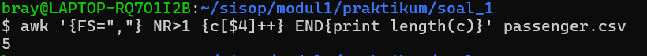

yang mana ``{FS=","}`` untuk memisahkan kolom karena dalam file ``csv`` karakter ``koma(,)`` itu merupakan pemisah antar kolom. Kemudian, ``{c[$3"-"$4]++}`` gunanya untuk meng-increment setiap kali ada pasangan unik dari kolom ke-3 dan ke-4, di akhir, command tersebut akan mengeprint banyaknya gerbong pada kereta tersebut.

Untuk memastikan gerbongnya tidak ada yang duplikat, kita dapat mengeceknya menggunakan command:

```
awk '{FS=","} NR>1 {c[$3"-"$4]++} END{for (l in c) print l}' passenger.csv
```

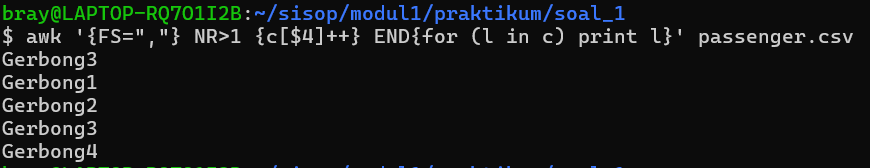

Ternyata, ``Business-Gerbong3`` terduplikat bukan karena datanya benar-benar ada dua yang sama, melainkan karena terdapat perbedaan karakter tersembunyi (whitespace) seperti spasi di awal atau akhir teks. Sehingga, untuk mendapat total gerbong yang tepat, kita dapat mengurangi ``length(c)`` dengan ``1``.

```
awk '{FS=","} NR>1 {c[$3"-"$4]++} END{print "Jumlah gerbong penumpang KANJ adalah " length(c)-1}' passenger.csv
```

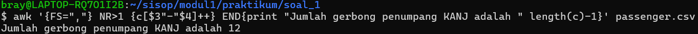

### c. Mengecek penumpang dengan usia tertua
Untuk mengeceknya, dapat dengan membandingkan nilai pada kolom kedua satu per satu. Kemudian, nilai yang paling besar nantinya akan di set nama dan usianya, sebagai penumpang tertua.

```
awk '{FS=","} NR>1 {if($2>max){name=$1;max=$2}} END{print name " adalah penumpang kereta tertua dengan usia " max " tahun"}' passenger.csv
```

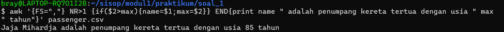

yang menarik dari awk itu sendiri, dia dapat mendeklarasikan variabel secara langsung tanpa menginisiasinya terlebih dahulu. Jadinya, variabel ``max`` disana secara default nilainya 0, sehingga bisa langsung membandingkan kolom ke-2 satu per satu secara langsung. Kemudian, karakter ``semi-colon(;)`` itu sama saja dengan ``enter``.

### d. Menghitung rata rata usia penumpang
Untuk menghitung rata ratanya dan membulatkannya, dapat menggunakan command:

```
awk '{FS=","} NR>1 {count++;sum+=$2} END{printf ("Rata-rata usia penumpang adalah %.0f tahun\n", sum/count)}' passenger.csv
```

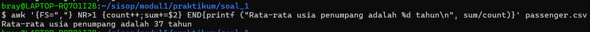

Jika dilihat, pada proses print, itu syntaxnya sama dengan bahasa C. Di bagian, ``NR>1 {count++;sum+=$2}`` ``sum`` digunakan untuk menjumlahkan seluruh usia penumpang dan ``count`` sebagai pembaginya (total penumpang).

### e. Menghitung total penumpang kategori kursi kelas bisnis
Untuk menghitungnya, kita dapat melakukan pengecekan dengan kondisi ``if ($3=="Business")`` untuk memastikan hanya baris dengan kelas Business yang dihitung. Setiap baris yang memenuhi kondisi tersebut akan menambah nilai variabel count sebanyak satu.

```
awk '{FS=","} NR>1 {if ($3=="Business"){count++}} END{print "Jumlah penumpang kelas bisnis ada " count " orang"}' passenger.csv
```

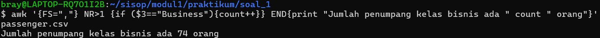

**Note:**

``END{print #var#}``: agar yang dicetaknya itu hanya baris terakhirnya saja.

### Buat file KANJ.sh
File ini dibuat untuk mempermudah penggunaan awk agar tidak terus menerus menuliskan command yang panjang untuk setiap soalnya, cara penggunaan dari file ini yaitu cukup dengan command:

``awk -f KANJ.sh passenger.csv [a/b/c/d/e]``

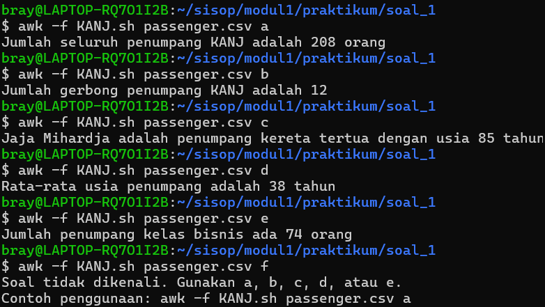

Isi file ``KANJ.sh``:
```
BEGIN {
    FS = ","
    opsi = ARGV[2]
    # Hapus agar tidak dianggap file input
    delete ARGV[2]
}

{
 if(NR>1)
 {
    if(opsi == "a") {
        count++
    }
    else if (opsi == "b"){
        c[$3"-"$4]++
    }
    else if (opsi == "c"){
        if($2>max){name=$1;max=$2}
    }
    else if (opsi == "d"){
        count++;sum+=$2
    }
    else if (opsi == "e"){
        if ($3=="Business"){count++}
    }
    else{
        print "Soal tidak dikenali. Gunakan a, b, c, d, atau e.\nContoh penggunaan: awk -f KANJ.sh passenger.csv a"
        exit
    }
 }
}

# Blok END harus berdiri sendiri di luar
END {
    if (opsi == "a") {
        print "Jumlah seluruh penumpang KANJ adalah " count " orang"
    }
    else if (opsi == "b"){
        print "Jumlah gerbong penumpang KANJ adalah " length(c)-1
    }
    else if (opsi == "c"){
        print name " adalah penumpang kereta tertua dengan usia " max " tahun"
    }
    else if (opsi == "d"){
        printf ("Rata-rata usia penumpang adalah %.0f tahun\n", sum/count)
    }
    else if (opsi == "e"){
        print "Jumlah penumpang kelas bisnis ada " count " orang"
    }
}
```
Di bagian ``if(NR>1)`` itu untuk mengabaikan baris pertama (header) pada file CSV, sehingga hanya data penumpang yang diproses. Kemudian, di bagian ``delete ARGV[2]`` digunakan untuk menghapus argumen ke-2 dari daftar input file yang dibaca oleh awk karena awk akan menganggap semua argumen setelah nama script sebagai file input. Terakhir, bagian ``END{...}`` digunakan untuk menampilkan hasil akhir setelah seluruh baris pada file selesai diproses.


## Soal 2
Pertama, download file ``peta-ekspedisi-amba.pdf``. Setelah berhasil, saya mengecek isi filenya, namun hanya terlihat peta saja, tidak ada informasi tambahan. Di soal, ada clue untuk mengecek filenya menggunakan command ``cat``, saya mengeceknya dan terdapat link github kemudian saya meng-*clonenya* dan di dalamnya terdapat file ``gsxtrack.json``.

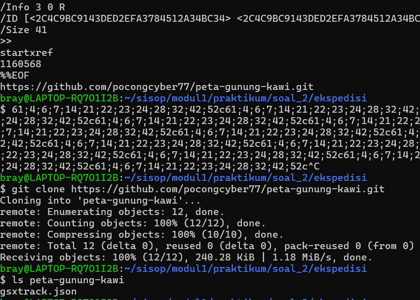

Seperti yang dikatakan di soal, file ``gsxtrack.json`` memuat beberapa titik lokasi dengan informasi site_name, latitude, dan lainnya. Saya membuat file ``parserkoordinat.sh`` untuk memparser koordinatnya. Isi file ``parserkoordinat.sh``:
```
#!/bin/bash

awk '
    /"id":/ {
    match($0, /"id": "([^"]+)"/, i)
    id = i[1]}

    /"site_name":/ {
    match($0, /"site_name": "([^"]+)"/, s)
    site = s[1]}

    /"latitude":/ {
    match($0, /"latitude": ([^,]+)/, lat)
    latitude = lat[1]}

    /"longitude":/ {
    match ($0, /"longitude": ([^,]+)/, long)
    longitude = long[1]}

    /^}/ {
    {if(id && site && latitude && longitude) print id "," site "," latitude "," longitude}
    }
    ' gsxtrack.json | sort -u > titik-penting.txt
echo "File udah di parser dan disimpen dengan nama titik-penting.txt. Silakan di cek..."
```
Isinya merupakan perintah awk untuk membaca file ``gsxtrack.json `` baris per baris dan mengekstrak informasi penting berupa ``id``, ``site_name``, ``latitude``, dan ``longitude`` menggunakan regular expression (regex) dan di akhir diberitahu jika proses parser telah selesai.

Di bagian 
```
/^}/ {
    if(id && site && latitude && longitude)
        print id "," site "," latitude "," longitude
}
```
``/^}/ {`` digunakan sebagai penanda akhir dari satu objek (node) dalam file JSON. Kemudian,  ``if(id && site && latitude && longitude)`` digunakan untuk memastikan semua data yang dibutuhkan sudah terisi sebelum dicetak. Setelah itu, hasilnya diproses dengan perintah: ``sort -u``untuk mengurutkan data berdasarkan id dan menghapus kemungkinan duplikasi data.

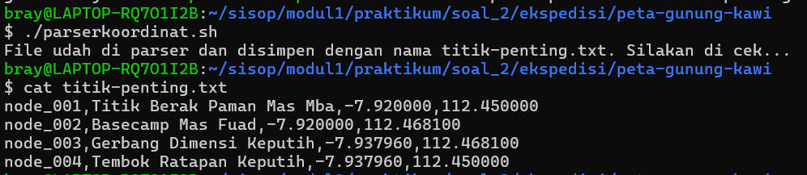

Terakhir, proses pencarian koordinat posisi pusakanya berdasarkan clue yang diberikan. Untuk itu, saya membuat file ``nemupusaka.sh`` yang isinya:
```
#!/bin/bash

awk '
BEGIN{FS=","}
NR==1 {lat1=$3; lon1=$4}
NR==3 {lat2=$3; lon2=$4}
END {
    mid_lat = (lat1 + lat2)/2
    mid_lon = (lon1 + lon2)/2
    printf "Koordinat pusat:\n%.6f,%.6f\n", mid_lat, mid_lon
}
' titik-penting.txt > posisipusaka.txt
cat posisipusaka.txt
echo "File udah kesimpen namanya: posisipusaka.txt"
```
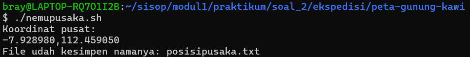

Didapatlah koordinat pusatnyaaa dan disimpen filenya dengan nama ``posisipusaka.txt``

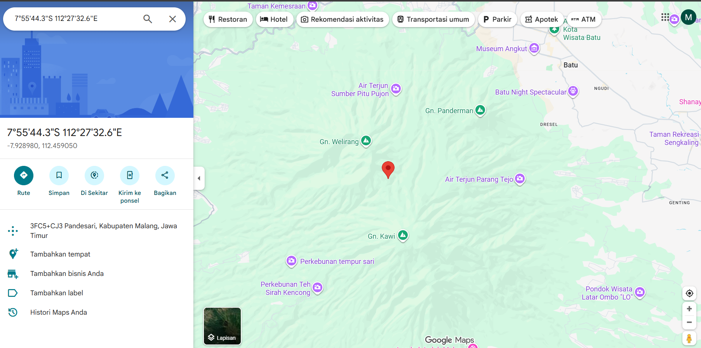

Struktur repo soal 2:

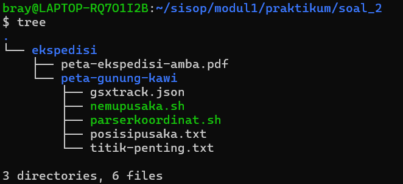

## Soal 3
Pada soal ini, saya membuat beberapa folder dan file sesuai dengan deskripsi pada soal. File ``kost_slebew.sh`` diberikan permission tambahan, yaitu ``+x`` dengan command: ``chmod +x kost_slebew.sh`` agar filenya dapat di eksekusi. Selain itu, saya juga menambahkan header untuk file ``penghuni.csv`` dan ``history_hapus.csv`` dengan command ``echo``.

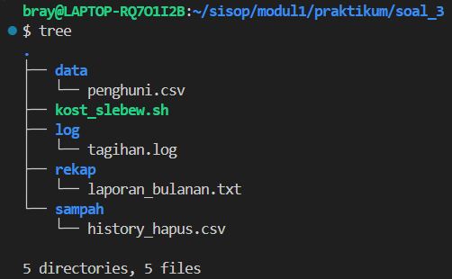

Kemudian, kode dalam file ``kost_slebew.sh`` ini dibagi menjadi beberapa bagian.

### a. Main menu
Secara penulisan dalam filenya, kode ini terletak di bagian paling bawah.
```
while true
do
    menu
    echo -n "Pilih [1 - 7] : "
    read pilih
    
    case $pilih in
        1)
        tambah_penghuni;;
        2)
        hapus_penghuni;;
        3)
        tampilkan_penghuni
        echo "--------------------------------------------------------------"
        awk '
        BEGIN{FS=",";m=0}
        NR > 1 {
        count++
        if ($5=="Aktif"){a++}
        if ($5=="Menunggak"){m++}
        }
        END{print "AKTIF: " a "          |      MENUNGGAK: " m "          |     TOTAL: " count}
        ' "$DATA"
        echo "--------------------------------------------------------------"
        ;;
        4)
        update;;
        5)
        laporan_keuangan;;
        6)
        kelola_cron;;
        7)
        echo "Keluar dari program."
        exit;;
        *)
        echo "Input yang di masukkan tidak valid.";;  
    esac
done
```

### b. Header Bash Script dan Deklarasi Variabel untuk File
Ini merupakan deklarasi variabel dari file file yang dibutuhkan agar kita tidak perlu menuliskan path lengkapnya ketika diperlukan. Selain itu, ditambahkan perintah: ``cd "$(dirname "$(realpath "$0")")"`` yang berfungsi untuk memastikan scriptnya selalu dijalankan dari direktori tempat script berada. Itu penting terutama saat script dijalankan melalui cron, karena cron tidak selalu menggunakan working directory yang sama.
```
#!/bin/bash

cd "$(dirname "$(realpath "$0")")"

DATA="data/penghuni.csv"
LOG="log/tagihan.log"
REKAP="rekap/laporan_bulanan.txt"
SAMPAH="sampah/history_hapus.csv"
```
### c. Fungsi Menu
Untuk menampilkan tampilan utama dan opsi yang ada.
```
function menu() {
    echo "=================================================="
    echo "██╗  ██╗ ██████╗ ███████╗████████╗     ███████╗██╗     ███████╗██████╗ ███████╗██╗    ██╗"
    echo "██║ ██╔╝██╔═══██╗██╔════╝╚══██╔══╝     ██╔════╝██║     ██╔════╝██╔══██╗██╔════╝██║    ██║"
    echo "█████╔╝ ██║   ██║███████╗   ██║        ███████╗██║     █████╗  ██████╔╝█████╗  ██║ █╗ ██║"
    echo "██╔═██╗ ██║   ██║╚════██║   ██║        ╚════██║██║     ██╔══╝  ██╔══██╗██╔══╝  ██║███╗██║"
    echo "██║  ██╗╚██████╔╝███████║   ██║        ███████║███████╗███████╗██████╔╝███████╗╚███╔███╔╝"
    echo "╚═╝  ╚═╝ ╚═════╝ ╚══════╝   ╚═╝        ╚══════╝╚══════╝╚══════╝╚═════╝ ╚══════╝ ╚══╝╚══╝"
    echo "=================================================="
    echo "        SISTEM MANAJEMEN KOST SLEBEW"
    echo "=================================================="
    echo "1. Tambah Penghuni"
    echo "2. Hapus Penghuni"
    echo "3. Tampilkan Penghuni"
    echo "4. Update Status"
    echo "5. Laporan Keuangan"
    echo "6. Kelola Cron"
    echo "7. Exit"
    echo "=================================================="
}
```
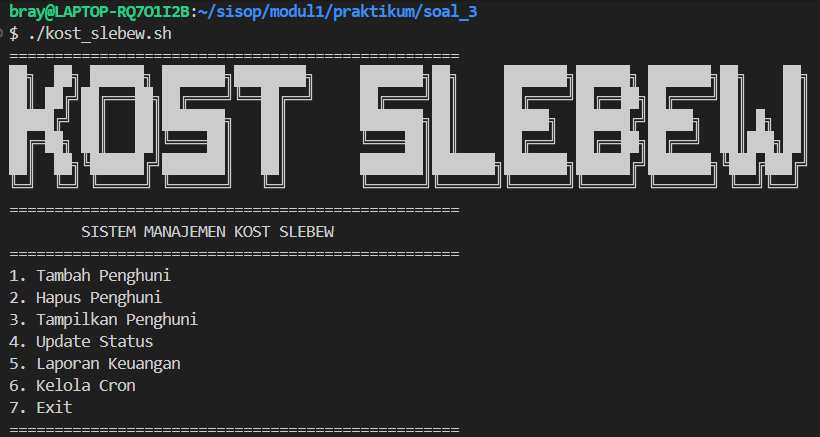
### d. Fungsi Tambah Penghuni
Untuk input data penghuni yang akan ditambahkan dan nantinya dimasukkan ke file ``penghuni.csv``

``nama``: Input nama bebas sesuai nama penghuni.

``no_kamar``: Inputnya harus berupa angka yang lebih besar atau sama dengan 0. Jika kamar sudah terisi, pengguna diminta memasukkan nomor lain.

``harga``: Input harus berupa angka dan bernilai lebih dari 0. Selain itu, pengguna diminta untuk input ulang.

``tanggal``: Input harus sesuai format ``YYYY-MM-DD``. Sistem juga memastikan tanggal tidak melebihi tanggal saat ini.

``status``: Hanya dapat diisi dengan ``Aktif`` atau ``Menunggak``. Selain itu, input akan dianggap tidak valid.
```
function tambah_penghuni() {
    echo "=================================================="
    echo "                 TAMBAH PENGHUNI                 "
    echo "=================================================="
    
    #masukin nama
    echo -n "Masukkan nama: "
    read nama
    
    #masukkin no kamar
    while true
    do
        echo -n "Masukkan nomor kamar: "
        read no_kamar
        if ! [[ $no_kamar =~ ^[0-9]+$ ]] 
        then
            echo "❌ Nomor kamar harus berupa angka >=0. Masukkin ulang..."
            continue
        fi

        if grep -q ",$no_kamar," ""$DATA""
        then
            echo "❌ Kamar sudah diisi orang lain, cari kamar lain..."
            continue
        fi
        break
    done
    
    #masukin harga
    while true
    do
        echo -n "Masukkan harga: "
        read harga

        if (! [[ $harga =~ ^[0-9]+$ ]]) || ([ $harga -le 0 ])
        then
            echo "❌ Harganya harus berupa angka > 0. Masukkin ulang..."
            continue
        fi
        break
    done

    #masukin tanggal
    while true
    do
        echo -n "Masukkan tanggal (YYYY-MM-DD): "
        read tanggal
        
        #cek format
        if [ $(date -d $tanggal +%F 2>/dev/null) != $tanggal ]
        then
            echo "❌ Format tanggal salah. Masukkin ulang..."
            continue
        fi
        #cek lebih
        if [[ $tanggal > $(date +%F) ]]
        then
            echo "❌Tanggal tidak boleh melebihi hari ini. Masukkin ulang..."
            continue
        fi
        break
    done

    #masukkin status
    while true
    do
        echo -n "Masukkin status (Aktif/Menunggak): "
        read status
        if [[ ($status != "Aktif") && ($status != "Menunggak") ]]
        then
            echo "❌ Input status cuma bisa Aktif atau Menunggak saja. Masukkin ulang..."
            continue
        fi
        break
    done
    echo "$nama,$no_kamar,$harga,$tanggal,$status" >> "$DATA"
    echo "✅ Penghuni $nama berhasil ditambahkan..."

}
```
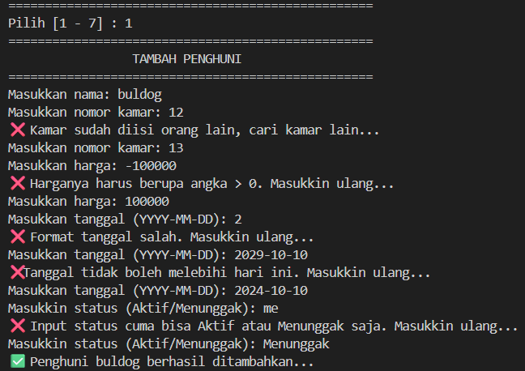

### e. Fungsi Hapus Data Penghuni
Pertama, ditampilkan dulu data penghuninya, kemudian pengguna akan diminta untuk memasukkan nama penghuni yang akan dihapus. Setelah itu, sistem akan mengecek:
- Jika tidak ditemukan, maka proses dibatalkan.
- Jika ditemukan lebih dari satu data dengan nama yang sama, pengguna akan diminta memasukkan nomor kamar untuk menentukan data yang spesifik.

Setelah data ditemukan:
- Data tersebut akan dihapus dari file utama (``penghuni.csv``).
- Data yang dihapus akan disimpan ke file arsip (``history_hapus.csv``) dengan tambahan tanggal penghapusan.
```
function hapus_penghuni() {
    tampilkan_penghuni
    
    if [ $(wc -l < "$DATA") -le 1 ]
    then
        echo "Kost belum punya penghuni..."
        return
    fi

    echo -n "Masukkan nama penghuni yang akan dihapus: "
    read nama
    
    #ambil semua data dengan nama yang diinputkan
    hasil=$(awk -v n="$nama" 'BEGIN{FS=","} $1==n {print}' "$DATA")
    jumlah=$(echo "$hasil" | wc -l)

    if [ $jumlah -gt 1 ]
    then
        echo "Penghuni dengan nama $nama ada lebih dari satu..."
        echo -n "Masukkan nomor kamar: "
        read kamar

        #ambil data spesifik nama + kamar
        data=$(awk -v n="$nama" -v k="$kamar" 'BEGIN{FS=","} $1==n && $2==k {print}' "$DATA")

        if [ -z ""$DATA"" ]; then
            echo "❌ Penghuni dengan nama dan kamar tersebut tidak ditemukan..."
            return
        fi

        #hapus
        awk -v n="$nama" -v k=$kamar '
        BEGIN{FS=",";OFS=","}
        !($1==n && $2==k) {print}
        ' "$DATA" > temp.csv && mv temp.csv "$DATA"
    else
        data=$hasil
        awk -v n="$nama" '
        BEGIN{FS=",";OFS=","}
        !($1==n) {print}
        ' "$DATA" > temp.csv && mv temp.csv "$DATA"
    fi

    #simpen ke sampah
    tanggal_hapus=$(date +%F)
    echo ""$data",$tanggal_hapus" >> $SAMPAH

    
    if [ $jumlah -gt 1 ]
    then
        echo "Penghuni "$nama" kamar $kamar berhasil dihapus"
    else
        if [ -z "$nama" ]
        then
            echo "Tidak ada data penghuni yang dihapus"
        else
        echo "Penghuni $nama berhasil dihapus"
        fi
    fi
}
```

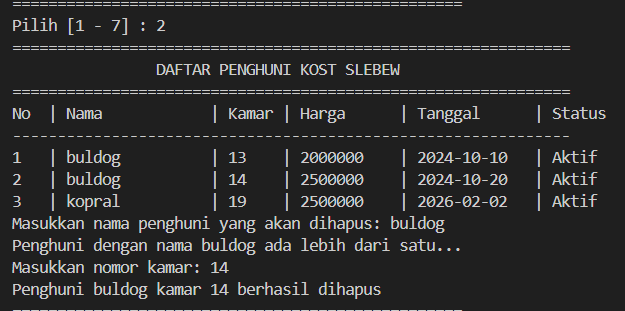
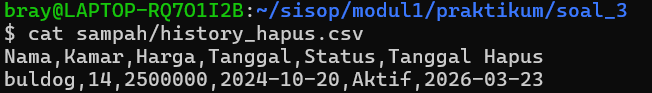

### f. Fungsi Tampilkan Data Penghuni
Menampilkan data penghuni secara lengkap. Kemudian, di akhir ditampilkan total penghuni beserta status ``Aktif`` atau ``Menunggak`` (Tapi bagian ini tidak tertulis di dalam fungsinya)
```
function tampilkan_penghuni() {
    echo "=============================================================="
    echo "                DAFTAR PENGHUNI KOST SLEBEW"
    echo "=============================================================="

    printf "%-3s | %-15s | %-5s | %-10s | %-12s | %-10s\n" \
    "No" "Nama" "Kamar" "Harga" "Tanggal" "Status"

    echo "--------------------------------------------------------------"

    awk '
    BEGIN{FS=","} NR>1 {
        printf "%-3d | %-15s | %-5s | %-10s | %-12s | %-10s\n",
        NR-1, $1, $2, $3, $4, $5
    }' "$DATA"
}
```
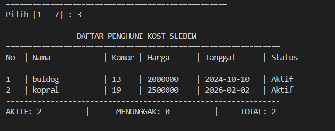

### g. Fungsi Update Status Data Penghuni
Untuk logic pada fungsi ini, mirip seperti fungsi ``hapus_penghuni``, yang membedakan disini ada input untuk mengupdate status penghuninya.
```
function update() {
    tampilkan_penghuni
    
    if [ $(wc -l < "$DATA") -le 1 ]
    then
        echo "Kost belum punya penghuni..."
        return
    fi

    echo -n "Masukkan nama penghuni yang akan diperbarui statusnya: "
    read nama
    
    #ambil semua data dengan nama yang diinputkan
    hasil=$(awk -v n="$nama" 'BEGIN{FS=","} $1==n {print}' "$DATA")
    jumlah=$(echo "$hasil" | wc -l)

    if [ $jumlah -gt 1 ]
    then
        echo "Penghuni dengan nama $nama ada lebih dari satu..."
        echo -n "Masukkan nomor kamar: "
        read kamar

        #ambil data spesifik nama + kamar
        data=$(awk -v n="$nama" -v k="$kamar" 'BEGIN{FS=","} $1==n && $2==k {print}' "$DATA")

        if [ -z ""$DATA"" ]; then
            echo "❌ Penghuni dengan nama dan kamar tersebut tidak ditemukan..."
            return
        fi
    fi

    while true
    do
        echo -n "Masukkin status (Aktif/Menunggak): "
        read status
        if [[ ($status != "Aktif") && ($status != "Menunggak") ]]
        then
            echo "❌ Input status cuma bisa Aktif atau Menunggak saja. Masukkin ulang..."
            continue
        fi
        break
    done

    if [ "$jumlah" -gt 1 ]; then
        awk -v n="$nama" -v k="$kamar" -v s="$status" '
        BEGIN{FS=",";OFS=","}
        {
            if($1==n && $2==k){
                $5=s
            }
            print
        }' "$DATA" > temp.csv && mv temp.csv "$DATA"
    else
        awk -v n="$nama" -v s="$status" '
        BEGIN{FS=",";OFS=","}
        {
            if($1==n){
                $5=s
            }
            print
        }' "$DATA" > temp.csv && mv temp.csv "$DATA"
    fi

    if [ $jumlah -gt 1 ]
    then
        echo "Status "$nama" kamar $kamar berhasil diperbarui"
    else
        if [ -z "$nama" ]
        then
            echo "Tidak ada data penghuni yang diperbarui"
        else
        echo "Status $nama berhasil diperbarui"
        fi
    fi
}
```
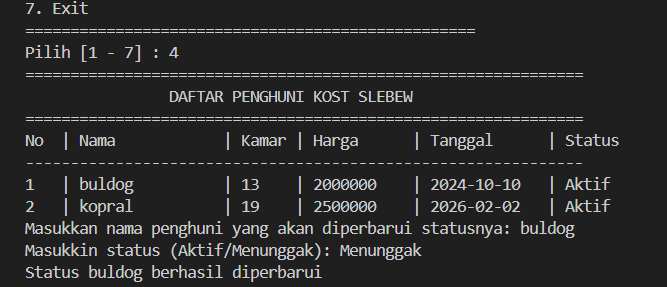

### h. Fungsi Laporan Keuangan
Fungsi ini digunakan untuk menyimpan dan menampilkan laporan keuangan kost berdasarkan data penghuni. Apabila ada penghuni yang masih menunggak, nama penghuni tersebut muncul dalam list. Kemudian, laporannya di simpan ke file ``laporan_bulanan.txt``.
```
function laporan_keuangan() {

    echo "=================================================="
    echo "           LAPORAN KEUANGAN KOST"
    echo "=================================================="

    if [ $(wc -l < "$DATA") -le 1 ]; then
        echo "Kost belum punya penghuni..."
        return
    fi

    awk '
    BEGIN{FS=",";jml_aktif=0;jml_nunggak=0;aktif=0;nunggak=0}
    NR>1 {
        if($5=="Aktif"){
            aktif += $3
            jml_aktif++
        }
        else if($5=="Menunggak"){
            nunggak += $3
            jml_nunggak++
            p[jml_nunggak] = $1
        }
    }
    END {
        print "Jumlah Penghuni Aktif     :", jml_aktif
        print "Total Pemasukan Aktif     : Rp", aktif
        print "-----------------------------------------"
        print "Jumlah Penghuni Menunggak :", jml_nunggak
        print "Total Tunggakan           : Rp", nunggak
        print "-----------------------------------------"
        print "Total Penghuni            : ", jml_aktif + jml_nunggak
        print "Total Keseluruhan         : Rp", aktif + nunggak
        print "-----------------------------------------"
        print "List Nama Penghuni Menunggak:"
        
        if(jml_nunggak==0){
        print "-Tidak ada penghuni menunggak-"
        }
        else{
        for(i=1;i<=jml_nunggak;i++){
            print i ". " p[i]
            }
        }

        print "-----------------------------------------"
        
    }' "$DATA" > "$REKAP" && cat "$REKAP"
}
```
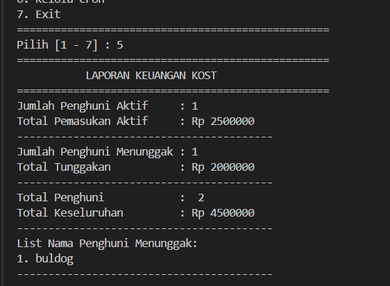

### i. Menu cron
- Untuk manggil command dari cron
Kode ini berfungsi untuk menglist penghuni yang menunggak dengan pengecekan bila argumennya ``--check-tagihan``. Kemudian, ``exit`` berguna untuk menghentikan script supaya tidak lanjut ke menu cron (agar ketika di simpan di file ``tagihan.log`` hanya dari hasil ``awk`` saja).
```
if [ "$1" == "--check-tagihan" ]
then
    awk -F',' '
    NR>1 && $5=="Menunggak" {
        waktu = strftime("%Y-%m-%d %H:%M:%S")
        printf "[%s] TAGIHAN: %s (Kamar %s) - Menunggak Rp%s\n", waktu, $1, $2, $3
    }
    ' "$DATA"
    exit
fi
```
- Fungsi menu cron
Ini seperti biasa meminta pengguna untuk menginputkan opsi, kemudian:

    1. Lihat Cron Aktif

        Untuk melihat cron yang aktif
    2. Tambah Cron

        Untuk menambahkan cron (jika belum ada). Jika sudah ada, cron sebelumnya akan dihapus dan diganti dengan yang baru. Kemudian, cron akan di eksekusi sesuai waktu yang dimasukkan -> menjalankan kode di atasnya (yang argumennya ``--check-tagihan``) -> menyimpannya ke file ``tagihan.log``
    3. Hapus
        Untuk menghapus cron yang aktif
    4. Kembali
        Untuk kembali ke main menu
```
function kelola_cron(){
    while true
    do
        echo "============================="
        echo "          KELOLA CRON        "
        echo "============================="
        echo "1. Lihat Cron Aktif"
        echo "2. Tambah Cron"
        echo "3. Hapus Cron"
        echo "4. Kembali"
        echo "============================="
        echo -n "Pilih [1 - 4]: "
        read opsi

        case $opsi in
        1)
        if crontab -l >/dev/null 2>&1
            then
                crontab -l
            else
                echo "belum ada crontab"
        fi
        ;;
        2)
        echo -n "Masukkan jam (0-23): "
        read jam
        echo -n "Masukkan menit (0-59): "
        read menit

        script_path="/home/bray/sisop/modul1/praktikum/soal_3/kost_slebew.sh"
        log_path="/home/bray/sisop/modul1/praktikum/soal_3/log/tagihan.log"

        command="$script_path --check-tagihan >> $log_path 2>&1"

        (
            crontab -l 2>/dev/null | grep -v -- "--check-tagihan"
            echo "$menit $jam * * * $command"
        ) | crontab -

        echo "✅ Cron berhasil ditambahkan!"
        ;;
        3)
        if crontab -l >/dev/null 2>&1
            then
                crontab -r
                echo "✅ Cron berhasil dihapus!"
            else
                echo "belum ada crontab"
        fi
        ;;
        4)
        break;;
        *)
        echo "Pilihan tidak valid";;
        esac
    done
}
```
### Kendala

Masih belum sepenuhnya memahami bagaimana cron berjalan.

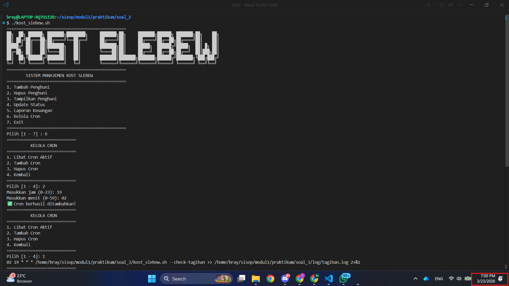
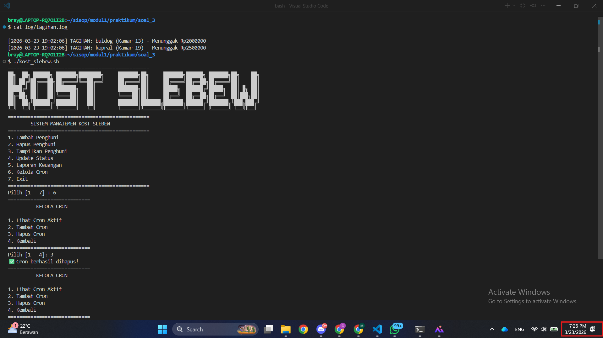

